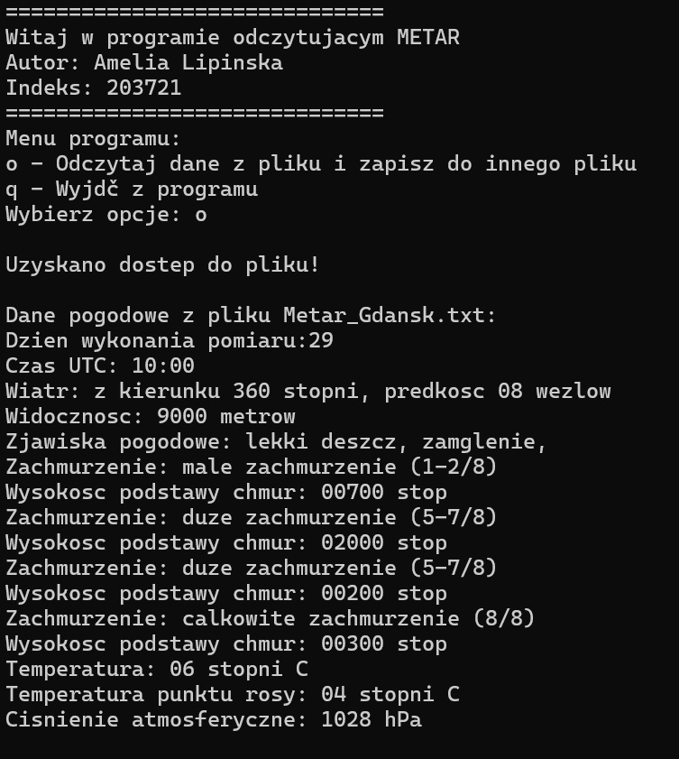

# METAR Weather Data Parser

## Overview
This is a **C++ console program** for reading, processing, and interpreting METAR weather data. It reads METAR reports from a text file, extracts key weather parameters, translates standard codes into readable descriptions, and outputs the data both to the console and to a file.

## Author
- **Name:** Amelia Lipińska  
- **Index Number:** 203721

#Example of the text inside the file:
EPGD 291000Z 36008KT 9000 -RA FEW007 BKN020 06/04 Q1028

EPGD 020500Z 17009KT 3000 BR BKN002 00/M00 Q1016 

EPGD 022200Z 23009KT 6000 OVC003 03/03 Q1012

#Translation of thet text by the program:

## Features
- Reads METAR data from a file (`Metar_Gdansk.txt`).  
- Extracts weather information including:
  - Wind direction and speed (including gusts and variable winds)
  - Visibility
  - Weather phenomena (rain, snow, fog, storms, etc.)
  - Cloud cover and cloud base heights
  - Temperature and dew point
  - Atmospheric pressure  
- Converts standard METAR abbreviations (like `RA`, `SN`, `TS`, `BKN`) into human-readable text.  
- Saves processed output to a file (`pogoda_gd.txt`).  
- Interactive console menu for ease of use.  

## How It Works
1. **Welcome Message:** The program displays an introduction with author info.  
2. **Menu:** Users can choose to:
   - Read and process METAR data (`o`)
   - Quit the program (`q`)  
3. **Processing Steps:**
   - Reads each line of METAR data.  
   - Extracts the date, UTC time, wind, visibility, weather phenomena, cloud cover, temperature, dew point, and pressure.  
   - Translates METAR codes into descriptive text.  
   - Displays the first few records on the console for preview.  
   - Writes all processed data to a file.  
4. **Repeat:** Users can process multiple files or exit via the menu.  
